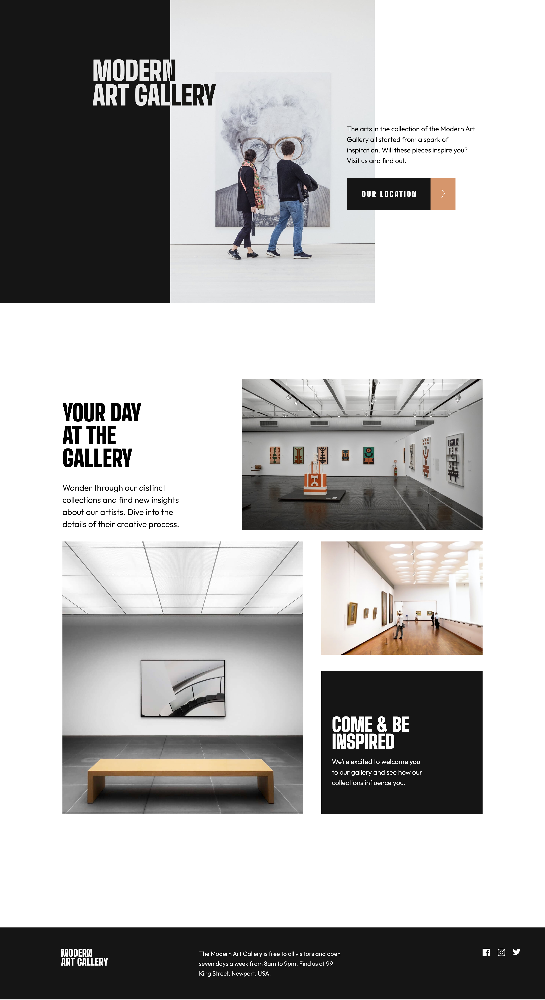
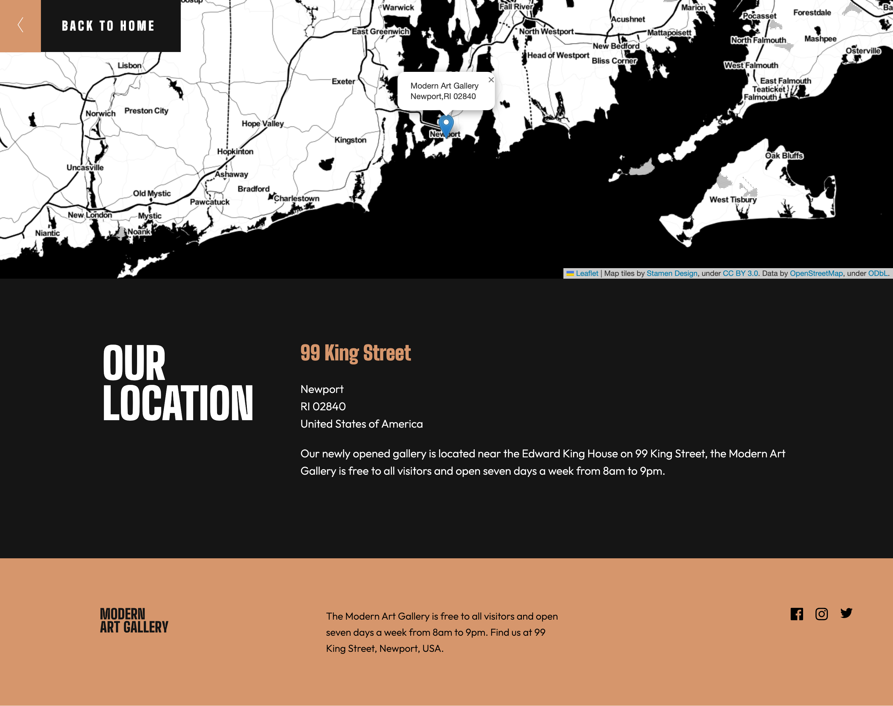

# Frontend Mentor - Art gallery website solution

This is a solution to the [Art gallery website challenge on Frontend Mentor](https://www.frontendmentor.io/challenges/art-gallery-website-yVdrZlxyA). Frontend Mentor challenges help you improve your coding skills by building realistic projects. 

## Table of contents

- [Overview](#overview)
  - [The challenge](#the-challenge)
  - [Screenshot](#screenshot)
  - [Links](#links)
- [My process](#my-process)
  - [Built with](#built-with)
  - [What I learned](#what-i-learned)
  - [Continued development](#continued-development)
  - [Useful resources](#useful-resources)
- [Author](#author)

## Overview

### The challenge

Users should be able to:

- View the optimal layout for each page depending on their device's screen size
- See hover states for all interactive elements throughout the site
- **Bonus**: Use [Leaflet JS](https://leafletjs.com/) to create an interactive location map with custom location pin

### Screenshot
**Home page**

**Location Page**

### Links

- Solution URL: [GitHub](https://github.com/ldg/artgallery-frontend)
- Live Site URL: [GitHub Pages Preview](https://ldg.github.io/artgallery-frontend/index.html)

## My process

### Built with

- Semantic HTML5 markup
- CSS custom properties
- SASS
- CSS Grid
- Mobile-first workflow
- [Leafletjs](https://leafletjs.com/) - JS library
- [Stamen Toner Map tiles](http://maps.stamen.com/#toner/12/37.7707/-122.3783) - Map Tile

### What I learned

I learned a lot on this project. Building off of my previous FEM project, I wanted to avoid the problems I had with displaying background images in Github Pages. So I simplified my folder structure and did a few test runs so that I could ensure that the background image links worked correctly. It took me a while to internalize the idea, that the background images are linked from the .css, not my SASS files. 

It seems a simple thing to recognize, but it took me a few test runs with different folder structures before it really took hold.

So this build I chose to use only background images so that I could more easily use media queries to switch images on different screensizes. This allowed me to mirror the img folder structure with my SASS partials so I had greater control when switching out the correct background image file for each screensize. This also made it easier to build my layouts with Grid CSS, since I didn't need to mess around with `<picture>` elements and `srcset` attributes.

I also learned a little about CSS filter() & mix-blend-mode, when trying to invert the overlapping header text. 

Additionally I got some exposure to leafletJS, and Stamen's map tiles. I found that Stamen's Toner map tile really worked well with the this projects design, so I swapped out the OpenStreetMap for Stamen's Toner map tiles and I think it looks really good.

### Continued development

I plan on continuing with Frontend Mentor projects for hands on practice building out frontends. I'm interested in working with a designer to build out custom Wordpress themes. I'm working on improving my vanilla javascript and hope to start learning React next.

### Useful resources

- [Dynamically Invert Text](https://stackoverflow.com/questions/50986688/invert-text-color-based-on-background-in-css) - This StackOverflow thread pointed the way for me, when trying to figure out how to dynamically invert text with CSS

## Author

- Website - [Scott McIntire](https://ldgwebdesign.com)
- Frontend Mentor - [@ldg](https://www.frontendmentor.io/profile/ldg)
- Twitter - [@scottm1164](https://twitter.com/scottm1164)

